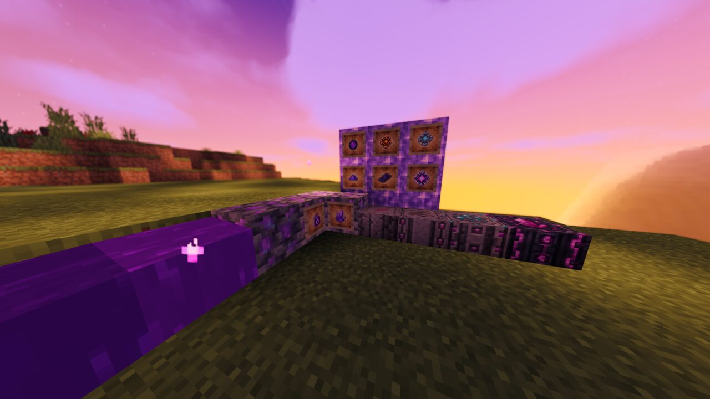
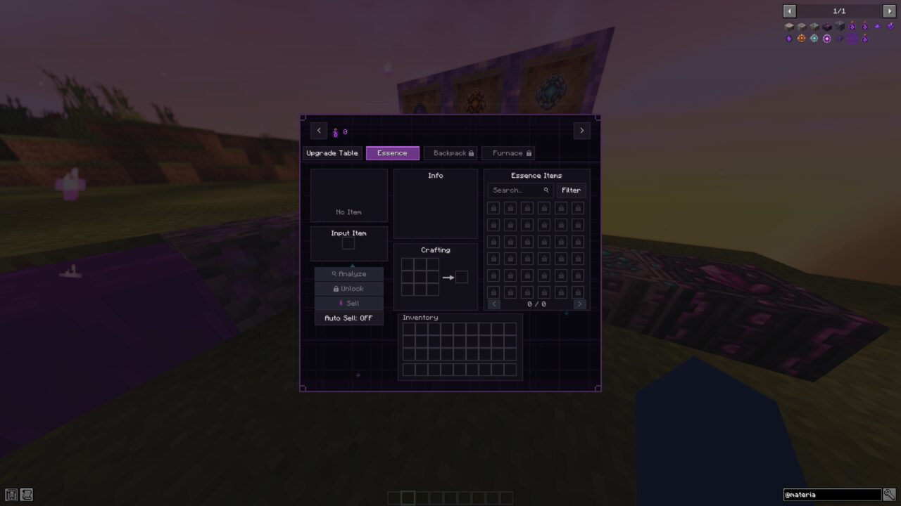
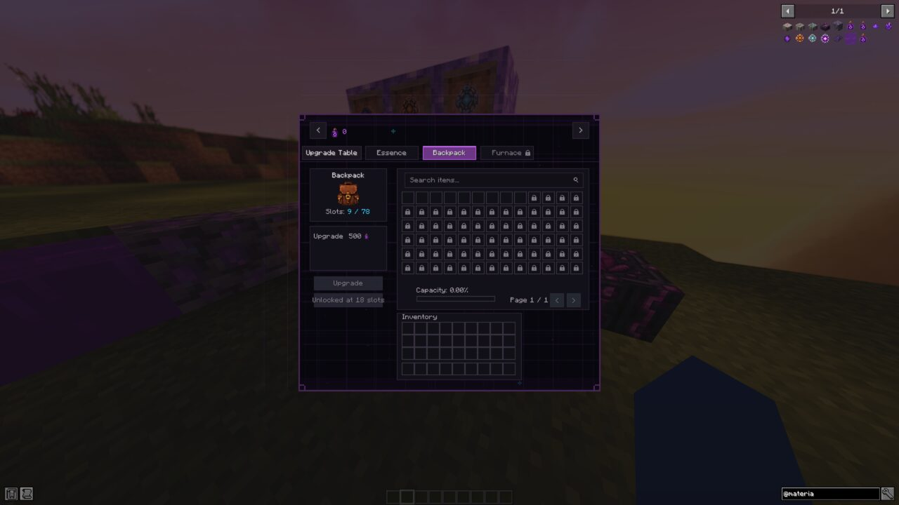
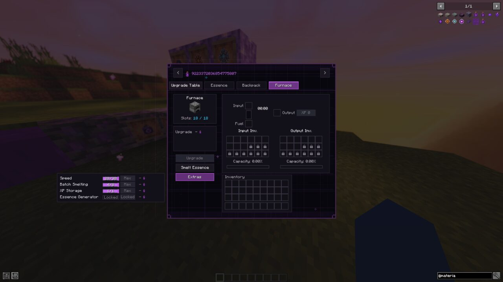
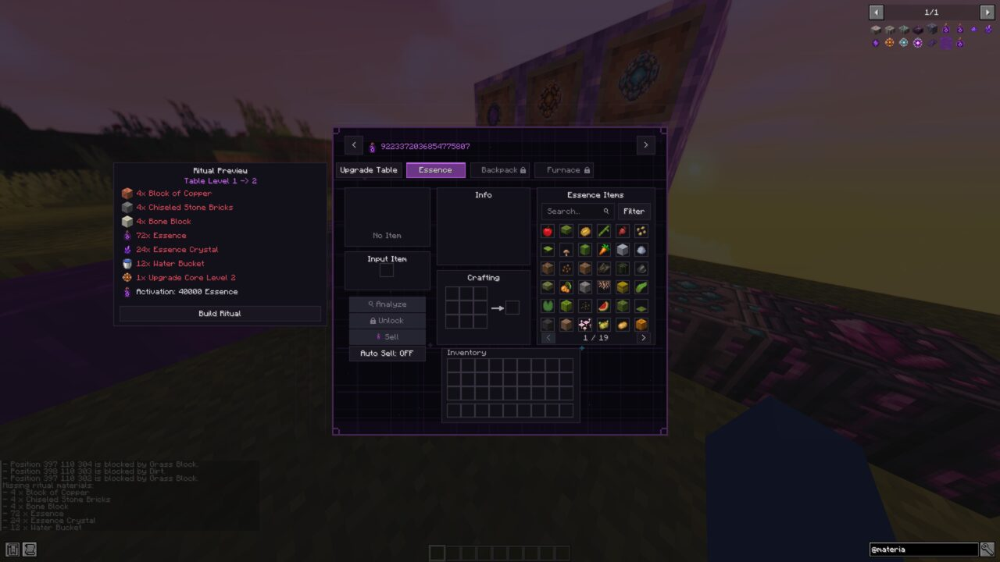
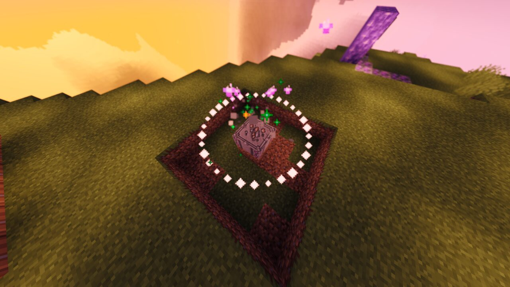

# Materia Reborn

**Materia Reborn** is a progression-focused Minecraft mod about discovering, collecting, and reshaping the value hidden in the world.

It is inspired by the freedom and item-transmutation ideas of ProjectE, but it is designed as its own experience. Progression is deliberate, powerful items are earned rather than rushed, and its systems are built around ideas I personally wanted to see in Minecraft.

> **Status:** Early development — features, balance, visuals, and compatibility may change.

**Official Modrinth page:** [click here](https://modrinth.com/mod/materia-reborn)

**Official Curseforge page:** [click here](https://www.curseforge.com/minecraft/mc-mods/materia-reborn/preview)

**You can also join our Discord :3 :** [click here](https://discord.gg/4YmYJc8JTb)

**Whaaat? Tiktok?:** [(click here)](https://www.tiktok.com/@materia.reborn)

## What makes it different?

Materia Reborn is not meant to be an instant, overpowered item printer. Players gradually expand their knowledge, storage, processing power, and access to stronger materials.

- **Essence-based transmutation** — analyse an item, unlock it permanently, then spend Essence to recreate it.
- **Meaningful progression** — item tiers, analysis requirements, and balanced buy/sell values make advancement feel earned.
- **Upgradeable Materia Table** — evolve the central table through rituals and unlock stronger systems over time.
- **Integrated backpack** — expand persistent storage and unlock stack-size, pickup, filtering, void, and retention upgrades.
- **Upgradeable furnace** — improve speed, batch processing, XP storage, and Essence-powered smelting.
- **Custom materials and rituals** — discover Essence Ore, create Liquid Essence, and build ritual structures to progress.
- **Configurable balance** — Essence values, unlock requirements, costs, item locks, upgrades, and other gameplay settings can be adjusted.

## In-game preview

| Essence | Backpack | Furnace |
| --- | --- | --- |
|  |  |  |

| Table upgrade ritual | Ritual in action |
| --- | --- |
|  |  |

## Current features

- Four Materia Table levels with staged progression.
- Persistent player Essence, item knowledge, slots, and upgrade progress.
- Configurable Essence catalogs split by table level.
- Custom ore generation, Liquid Essence, particles, effects, recipes, and rituals.
- In-game configuration screens and administrative commands.
- Optional JEI and Just Enough Resources integration.

## Requirements

- Minecraft 1.21.1
- NeoForge 21.1.235 or a compatible newer 21.1.x version
- Java 21

JEI and Just Enough Resources are optional integrations.

## Configuration

Runtime settings are generated under `config/materia_reborn`. Gameplay settings use TOML, while editable Essence item catalogs use JSON.

## Source snapshot

This repository currently contains the mod source, resources, and architecture documentation for reading, review, and continued development. Local build configuration, dependency binaries, generated output, runtime worlds, logs, release JARs, and machine-specific files are intentionally excluded from this snapshot.

See [docs/architecture.md](docs/architecture.md) for a technical overview.

## Feedback and bug reports

- Found a problem? Open a **Bug report** and include the Minecraft/mod version, clear reproduction steps, and relevant logs or screenshots.
- Have an idea? Open a **Feature request** and explain how it fits the progression-focused direction of the mod.

## Credits and inspiration

Materia Reborn is an independent project. ProjectE provided early inspiration for the general transmutation concept; this mod is not affiliated with or endorsed by ProjectE or its creators.

## License

Materia Reborn is available under the [MIT License](LICENSE.md).
